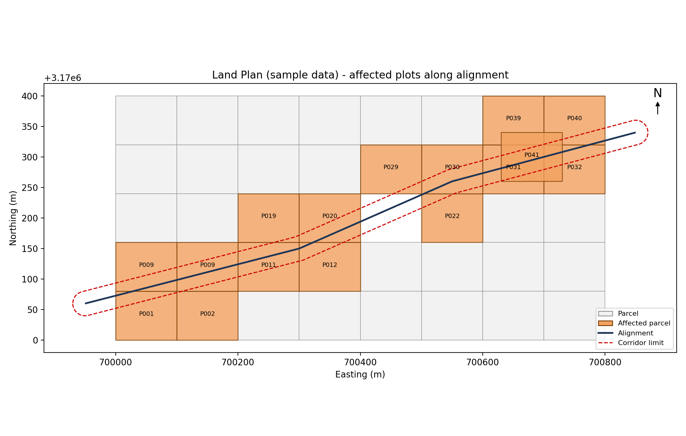

# Land Parcel Validation Toolkit

Python and GeoPandas tools for the first steps of land referencing on a linear infrastructure scheme (road, rail, pipeline):

1. **Validate parcel data** and produce a QA report.
2. **Identify affected plots** along an alignment and produce a Book of Reference style schedule (Excel) and a Land Plan style map (PNG).

> **Note:** All data in this repository is **synthetic sample data** created for demonstration. No real land records or personal information are used.

### 1. `validate_parcels.py` - parcel data QA
Checks a parcel layer for:

- missing or unexpected coordinate reference system (CRS)
- empty or invalid geometries (for example self-intersections)
- duplicate plot numbers
- missing owner names
- declared area vs. mapped area mismatch (configurable tolerance)
- overlapping parcels

Output: `outputs/qa_report.csv`

### 2. `affected_plots.py` - affected plot identification
Buffers the alignment by a corridor width, intersects it with the parcels, and reports total and affected area per plot.

Outputs:
- `outputs/book_of_reference.xlsx` - schedule with plot number, owner, occupier, areas, and whole/part take
- `outputs/land_plan.png` - map of the alignment, corridor and affected parcels


```bash
pip install -r requirements.txt
python make_sample_data.py      # creates data/parcels.gpkg and data/alignment.gpkg
python validate_parcels.py      # QA report
python affected_plots.py        # schedule and map
```

Useful options:

```bash
python validate_parcels.py --tolerance 2
python affected_plots.py --buffer 30
```

The sample data contains deliberately planted errors (a missing owner, a duplicate plot number, an area mismatch, an invalid geometry and an overlapping parcel) so the QA script has something to find. Open `data/parcels.gpkg` and `data/alignment.gpkg` in QGIS to inspect them.

## Tools
Python, GeoPandas, Shapely, pandas, openpyxl, Matplotlib. Data viewed and checked in QGIS.

## Limitations
- Uses a simple buffer corridor; real schemes use defined limits of deviation and ownership data from official records.
- Sample data is a regular grid, not real cadastral parcels.

## Example output


## Author
Rajashwi Saxena - M.Sc. Geoinformatics, TERI School of Advanced Studies
